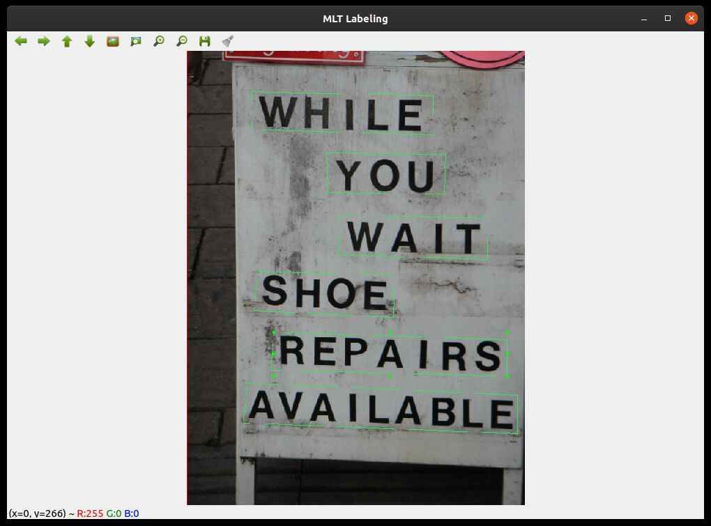

# MLT Labeling
MLT Labeling application let you edit bounding boxes for text images as ICDAR 2017 dataset way. (https://rrc.cvc.uab.es/?ch=8&com=tasks)

This tool is largely inspired from OpenLabel source code (https://github.com/Cartucho/OpenLabeling), but instead of using Rectangles, we use 4 points Polylines and output text ground truth files instead of PascalVOC or Yolo.

 gt txt file format is 4 positions points clock wised followed by a label name separeted by commas :
```
768,10,815,10,815,56,768,56,Something
544,325,592,325,592,358,544,358,SomethingElse
```
 MLT Labeling application has actually no possibility to label bounding boxes (no idea if this can be done in OpenCV QT5 Gui anyway), but this is not really necessary if only training text position detection.
 Existing labels are keept untouched if existing and BBox is not deleted.


 
## Requierements
opencv4 (with QT5 support highly recommanded)  
numpy  
 
## Usage

### Start application 
 Start Mlt Labeling Application with the following command:  
 ``` python mlt_labeling.py ```

### Keys
keys are:  
 - "h" key will show help  
 - "s" save current image and bounding boxes  
 - "n" key to load next image  
 - "p" key to load previous image  
 - "q" key to exit application  

Note that when saving, images are resized to a rounded 16x multiple for some normalizing purpose.
When loading next or previous image or exit application, bbox are not saved automatically.
 
### Points creation
Simply click left or middle button to create new points
When creating Points, you must respect the following clockwise order :
```
[1]------------[2]
 |              |
 |              |
[4]------------[3]
```
(no control is done yet on point selecting order, but this could appear soon)

### Move anchors
Double click left in a BBox. Anchors will appear as 9 small green squares.
You can then select and drag any anchor to any direction to adjust bounding box.

Due to default opencv behaviours, when zooming left button can not really be used anymore to drag anchors. 
You must then use middle button to select anchors. 
Selected anchor will then be sticked to mouse position until left button is clicked

This behaviour can appear disturbing, but is finally not that bad.

Anchors are draw on a rectangle from left upper point to right bottom point. This is partly a bug and a feature since its an openlabeling herited behaviour and it help to adjust points on a rectangle.

### Delete Bounding Box
Simply double right click a box

